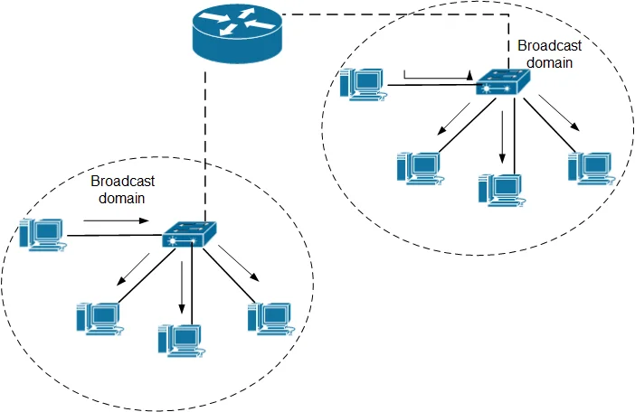

## VLANs 

# Cisco ARS92 Routers & Catalyst 3750 series switches

- Broadcast - a form of telecommunication where messages are sent to recipients simultaneously 
- Broadcast domains - all nodes can reach eachother by broadcast at the datalink layer. This refers to a switch that is connected to end-devices and can reach those devices by broadcast.

# What is a Virtual Network?

